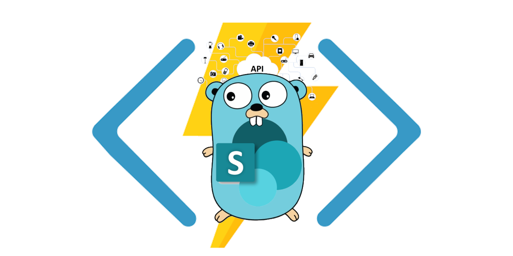

# Azure Functions Golang & SharePoint Sample



## Prerequisites

- [Azure Functions Core Tools, v3](https://www.npmjs.com/package/azure-functions-core-tools)
- [Go SDK](https://golang.org/dl/)
- [Visual Studio Code](https://code.visualstudio.com) & [Azure Functions extension](https://marketplace.visualstudio.com/items?itemName=ms-azuretools.vscode-azurefunctions)
- [Azure CLI](https://docs.microsoft.com/en-us/cli/azure/install-azure-cli) [optional]

> Mac or Linux machine, or Windows WSL2 are preferred.
> All the commands within the sample assumed running in `bash`.

## Create Azure Function Resource

> This flow is dev friendly when it comes to quick experiments. For production deployments please consider infrastructure as code and automation via DevOps.

In VS Code with Azure Functions extension installed:

- `CMD+Shift+P` type `Azure Functions: Create Function App in Azure... (Advanced)` and follow the wizard (further is the example of the steps)
- Select dev subscription
- Enter a globally unique name for the new function app
- Select a runtime stack: `Custom Handler`
- Select an OS: `Linux`
- Select a hosting plan: `Consumption`
- Create a new resource group
- Enter the name of the new resource group
- Create new storage account
- Enter the name of the new storage account
- Create new Application Insights resource
- Enter the name of the new Application Insights resource
- Select a location for new resources (closer to your location)

> Don't forget to remove the resource group after experiments to avoid any unpredictable charges

## Project structure highlights

- `.vscode/` - VSCode settings folder, mostly standard, however, `settings.json` has important modification `"azureFunctions.deploySubpath": "./functions"` which changes root folder for functions deployment via `ms-azuretools` extension
- `functions/` - everything related to Azure Functions, isolation makes things simpler while no mixing with custom handler related project files
  - Functions folders, containing `function.json` file
  - `.funcignore` - functions ignore file with handy ignore options
  - `host.json` - host configuration file, mostly standard, interesting and important section is `customHandler`, especially `"enableForwardingHttpRequest": true` which is not added by default
  - `local.settings[.sample].json` - contains configuration which is needed for local development and debug, local settings should be excluded from Git to avoid secrets leak
  - `proxies.json` - bypassing endpoints to external resources
- `handlers/` - Handlers sub package grouping by extensible handlers methods
- `debug.go` - grabs Azure Functions settings to use when starting the handlers' server separately, is not included into production build
- `main.go` - Custom Handler Go server entry point
- `mux.go` - routes and handler binding configuration
- `sp.go` - SharePoint Client and authentication constructor
- `Makefile` - useful tasks/commands collection for project automation

## Local start/debug

- Copy/rename `local.settings.sample.json` to `local.settings.json`.
- Provide authentication parameters:
    - SPAUTH_SITEURL
    - SPAUTH_CLIENTID
    - SPAUTH_CLIENTSECRET

[Add-in Only auth](https://go.spflow.com/auth/strategies/addin) is used as a sample.

- Start the local server with ```make start```
- Navigate to one of the URL endpoints printed in the console

## Debugging Go code

For breaking points debugging in VSCode a number of approaches can be used: attaching to process or connecting to server. In most cases, one would prefer restarting Go server without stoping and restarting `func start` session. Also, it's simpler to place a breakpoint, switch to `main.go` file, and launch debug. Such a scenario can be covered with:

```bash
make debug
```

The local function app is started without actually starting the Go side-car server, but mimicking the process for functions core utility.

Then, the Go application can be started or restarted as many times as needed, e.g. using `go run ./` or launch debug UI.

## Build and deploy

1\. Run build command:

```bash
make build-prod
```

The assumption is that a Linux plan was selected for the function app.

The build creates `bin/server` binary with the Go custom handler.

2\. In VSCode,

- `CMD+Shift+P` type `Azure Functions: Deploy to Function App...`
- Select subscription
- Select Function App in Azure
- Confirm deployment

## Publish via CLI

```bash
make appname="functionapp_name" publish
```

where `"functionapp_name"` is the name of your Function App instance.

> `az` CLI is required.

## Configure environment variables

In the Azure Function app, create and provide the following environment variables:
- SPAUTH_SITEURL
- SPAUTH_CLIENTID
- SPAUTH_CLIENTSECRET

Depending on the SharePoint environment and use case, [auth strategy](https://go.spflow.com/auth/strategies) can be different. For a production installation [Azure Certificate Auth](https://go.spflow.com/auth/custom-auth/azure-certificate-auth) might be preferred.

`sp.go/getSP` handler should be aligned with authentication parameters.

## SharePoint API in Go

The API layer is powered by [gosip](https://github.com/koltyakov/gosip).

## Reference

- [Azure Functions custom handlers](https://docs.microsoft.com/en-us/azure/azure-functions/functions-custom-handlers)
- [Create a Go function in Azure using VSCode](https://docs.microsoft.com/en-us/azure/azure-functions/create-first-function-vs-code-other)
- [Functions Custom Handlers (Go)](https://github.com/Azure-Samples/functions-custom-handlers/tree/master/go)